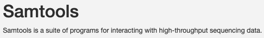
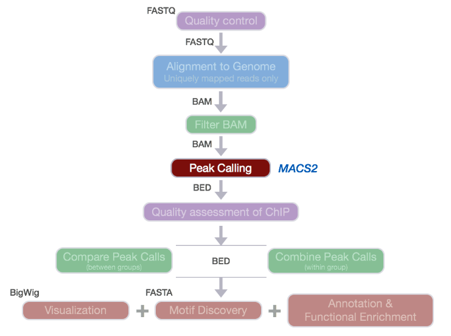
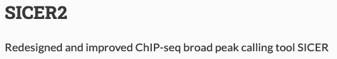
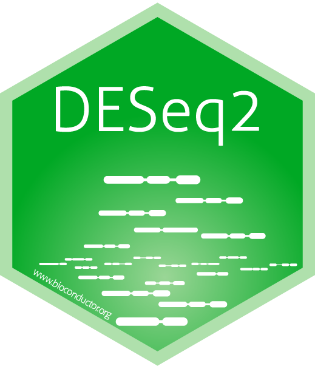
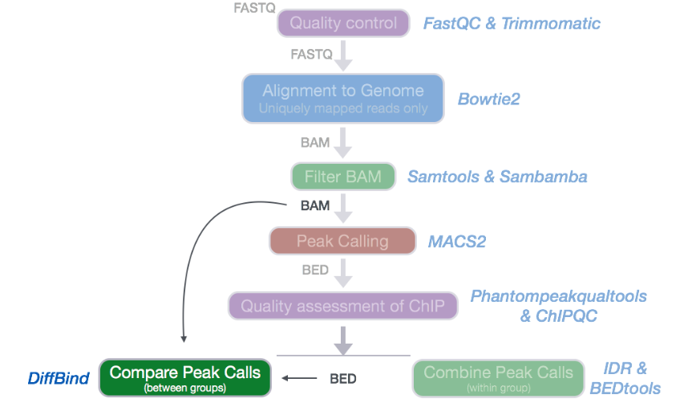

# Documentation

| **Methods**                 |
------------------------------|
| [DeepTools](#deeptools)     |
| [SamTools](#samtools)       |
| [Bowtie2](#bowtie2)         |
| [Macs2](#macs2)             |
| [Sicer2](#sicer2)           |
| [DESeq2](#deseq2)           | 
| [Snakemake](#snakemake)     |
| [DiffBind](#diffbind)       |
| [RegEx](#regex)             |

# DeepTools

+ https://deeptools.readthedocs.io/en/develop/

# SamTools

+ http://www.htslib.org/doc/samtools.html

# Bowtie2

+ https://bowtie-bio.sourceforge.net/bowtie2/manual.shtml

# Macs2

+ https://hbctraining.github.io/Intro-to-ChIPseq/lessons/05_peak_calling_macs.html

# Sicer2

+ https://zanglab.github.io/SICER2/

# DESeq2

+ http://bioconductor.org/packages/devel/bioc/vignettes/DESeq2/inst/doc/DESeq2.html

# Snakemake

+ https://snakemake.readthedocs.io/en/stable/

# DiffBind

+ https://github.com/kevinboyd76/Bioinformatic_Tools/blob/main/Documentation/DiffBind.pdf

# RegEx

+ https://github.com/kevinboyd76/Bioinformatic_Tools/blob/main/Documentation/RegX_CheetSheet.pdf
